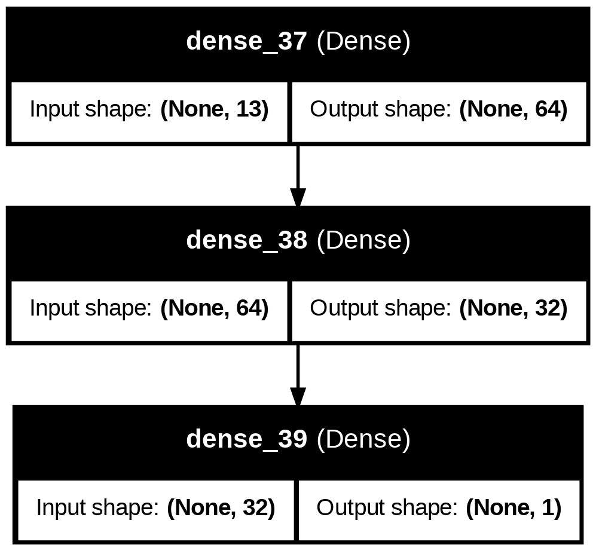

# Traffic Congestion Prediction using Machine Learning and Neural Networks

## 🚦 Project Overview

This project aims to develop and evaluate various machine learning and deep learning models to predict traffic congestion. Utilizing a synthetic dataset simulating urban traffic, the goal is to classify traffic situations as either 'congested' or 'not congested'. This predictive capability can aid in proactive traffic management strategies in cities like Kigali, mitigating negative impacts on productivity, environment, and daily commutes.

The project demonstrates the implementation of a classical machine learning algorithm (Logistic Regression) with hyperparameter tuning, alongside multiple Neural Network (NN) architectures incorporating various optimization and regularization techniques. Error analysis is performed using metrics like F1-score, Precision, Recall, Accuracy, ROC AUC, and Confusion Matrices.

## 📋 Table of Contents

1.  [Dataset Description](#1-dataset-description)
2.  [Project Structure](#2-project-structure)
3.  [Model Architectures and Implementations](#3-model-architectures-and-implementations)
    * [Classical ML Model: Logistic Regression](#classical-ml-model-logistic-regression)
    * [Neural Network Models](#neural-network-models)
4.  [Optimization and Regularization Combinations](#4-optimization-and-regularization-combinations)
5.  [Results Discussion and Analysis](#5-results-discussion-and-analysis)
6.  [Making Predictions on Test Data](#6-making-predictions-on-test-data)
7.  [Instructions to Run the Notebook](#7-instructions-to-run-the-notebook)
8.  [Conclusion](#8-conclusion)

## 1. Dataset Description

**Brief Description:**
This project utilizes a synthetic dataset simulating traffic flow at an urban intersection. The dataset provides various parameters related to vehicle counts (cars, bikes, buses, trucks) at specific times of the day and days of the week, along with a pre-classified 'Traffic Situation' label. The 'Traffic Situation' column categorizes the traffic into states like 'low', 'normal', 'heavy', and 'high'.

**Problem Statement:**
Rapid urbanization often leads to significant traffic congestion, negatively impacting economic productivity, environmental quality, and the daily commute. Predicting traffic congestion can enable proactive traffic management strategies, such as dynamic traffic light control, route optimization, or public transport planning, thereby mitigating its adverse effects. Our primary task is to build a classification model that can predict whether the traffic will be 'congested' (defined as 'heavy' or 'high') or 'not congested' ('low' or 'normal').

**Dataset Characteristics:**
* **Initial Shape:** (2976 rows, 9 columns)
* **Unique 'Traffic Situation' Values:** `['low', 'normal', 'heavy', 'high']`
* **Processed Features (X) Shape:** (2976, 13) after feature engineering and one-hot encoding.
* **Target (y) Shape:** (2976,)

**Data Preprocessing and Splitting:**
The following steps were applied:
* The `Time` column was converted into cyclical features (`hour_sin`, `hour_cos`).
* The `Day of the week` column was one-hot encoded.
* The `Traffic Situation` column was transformed into a binary `Congested` target variable:
    * `0` (Not Congested) for 'low', 'normal'
    * `1` (Congested) for 'heavy', 'high'
* Numerical features were scaled using `StandardScaler`.
* The dataset was split into Training, Validation, and Test sets with a 70%/15%/15% ratio, ensuring stratification to maintain class proportions.

**Class Distribution in Target Variable (Congested):**
* Class 0 (Not Congested): Approximately 66.3%
* Class 1 (Congested): Approximately 33.7%
    *(This indicates a moderate class imbalance, which metrics like F1-score and Recall help to assess.)*

## 2. Project Structure

The project is organized to promote modularity and clarity:

* `notebook.ipynb`: The main Jupyter Notebook containing all the code, model implementations, training, evaluation, and analysis.
* `your_new_traffic_dataset.csv`: The dataset file used for the project. **(Note: Please ensure this file is in the same directory as the notebook or update the path within the notebook).**
* `saved_models/`: A directory created by the notebook to store all trained models.

**Contents of `saved_models/`:**
This directory contains 5 trained models as required by the assignment:
* `logistic_regression_model.pkl` (Classical ML model)
* `NN_Model_2_Baseline_Adam.h5` (Neural Network Baseline)
* `NN_Model_3_Adam_Dropout_ES.h5` (Neural Network with Adam, Dropout, Early Stopping)
* `NN_Model_4_RMSprop_L2.h5` (Neural Network with RMSprop, L2 Regularization)
* `NN_Model_5_Adam_L2_Variant.h5` (Neural Network with Adam, L2 Regularization, and variant architecture)

## 3. Model Architectures and Implementations

The code is modularized using functions for defining, training, and evaluating models.

### Classical ML Model: Logistic Regression

* **Implementation:** `sklearn.linear_model.LogisticRegression`
* **Optimization:** Hyperparameters `C` (inverse of regularization strength) and `solver` were tuned using `GridSearchCV` to find the optimal combination for performance.
* **Best Parameters Found:** `{'C': 10.0, 'solver': 'liblinear'}`

### Neural Network Models

All Neural Network models are built using Keras/TensorFlow. A flexible `define_model` function allows for creating different architectures with various optimizers, learning rates, regularization (Dropout, L2), and number of layers/neurons. The `train_and_evaluate_nn` function handles the training loop, including early stopping and verbose output.




**1. NN Model 2 (Baseline Adam)**
* A simple, foundational neural network.
* **Optimization:** Uses default Adam optimizer (learning rate 0.001).
* **Regularization:** No explicit regularization (Dropout or L2) applied.
* **Architecture:** 2 dense layers with (64, 32) neurons.

**2. NN Model 3 (Adam, Dropout, Early Stopping)**
* **Optimization:** Adam optimizer with a custom learning rate (0.0005).
* **Regularization:** Incorporates Dropout layers (0.3 and 0.2 rates) to prevent overfitting.
* **Techniques:** Uses `EarlyStopping` callback to monitor validation loss and stop training when improvement ceases, preventing overfitting and optimizing training time.
* **Architecture:** 3 dense layers with (128, 64, 32) neurons.

**3. NN Model 4 (RMSprop, L2 Regularization)**
* **Optimization:** Uses RMSprop optimizer (default learning rate 0.001).
* **Regularization:** Applies L2 kernel regularization (`0.001` strength) to dense layers.
* **Architecture:** 2 dense layers with (64, 32) neurons.

**4. NN Model 5 (Adam, L2 Regularization Variant)**
* **Optimization:** Adam optimizer with a custom learning rate (0.0008).
* **Regularization:** Applies L2 kernel regularization (`0.0005` strength).
* **Architecture:** 2 dense layers with (50, 25) neurons, a slightly smaller architecture to explore impact.

## 4. Optimization and Regularization Combinations

The following table summarizes the key parameters and validation set performance metrics for each implemented model.

| Training instance | Optimizer used(Adam, RMSprop) | Regularizer Used | Epochs | Early Stopping (Yes or No) | Number of Layers | Neurons per Layer | Learning Rate | Accuracy (Val) | F1-score (Val) | Recall (Val) | Precision (Val) | ROC AUC (Val) |
| :---------------- | :---------------------------- | :--------------- | :----- | :------------------------- | :--------------- | :---------------- | :------------ | :------------- | :------------- | :----- | :-------- | :------------ |
| **Instance 1 (Logistic Regression)** | N/A (liblinear solver) | L1/L2 (via C=10.0) | N/A | N/A | N/A | N/A | N/A | 0.9462 | 0.9226 | 0.9533 | 0.8938 | 0.9916 |
| **Instance 2 (NN Baseline)** | Adam (default) | None | 50 | No | 2 | 64, 32 | 0.001 (default) | 0.9596 | 0.9408 | 0.9533 | 0.9286 | 0.9935 |
| **Instance 3 (NN Adam, Dropout, ES)** | Adam | Dropout (0.3, 0.2) | Up to 100 (Early Stopped) | Yes | 3 | 128, 64, 32 | 0.0005 | 0.9574 | 0.9381 | 0.9600 | 0.9172 | 0.9939 |
| **Instance 4 (NN RMSprop, L2)** | RMSprop | L2 (0.001) | 50 | No | 2 | 64, 32 | 0.001 (default RMSprop) | 0.9596 | 0.9416 | 0.9667 | 0.9177 | 0.9944 |
| **Instance 5 (NN Adam, L2 Variant)** | Adam | L2 (0.0005) | 60 | No | 2 | 50, 25 | 0.0008 | **0.9619** | **0.9450** | **0.9733** | 0.9182 | **0.9947** |

## 5. Results Discussion and Analysis

**Comparison of Neural Network Combinations:**
Based on the validation metrics, **NN Model 5 (Adam, L2 Variant)** appears to be the best-performing neural network. It achieved the highest Accuracy (0.9619), F1-Score (0.9450), Recall (0.9733), and ROC AUC (0.9947) on the validation set. This suggests that the combination of the Adam optimizer with a slightly lower learning rate (0.0008) and L2 regularization (0.0005 strength), combined with its chosen architecture, generalized slightly better to unseen data compared to the other NN configurations.

* **Baseline (Model 2):** Provides a solid starting point, indicating the dataset is relatively separable even without advanced techniques.
* **Dropout & Early Stopping (Model 3):** While not the absolute top performer in terms of validation F1, these techniques are crucial for preventing overfitting, especially on larger or noisier datasets. Early stopping efficiently found a good convergence point.
* **RMSprop & L2 (Model 4):** Showed strong performance, very close to the baseline and slightly better F1-score, suggesting RMSprop and L2 are effective.
* **Adam & L2 Variant (Model 5):** The slight adjustments in learning rate and L2 strength, combined with a slightly different neuron count, yielded the highest performance, highlighting the impact of fine-tuning these parameters.

**Comparison between Classical ML (Logistic Regression) and Neural Networks:**

The **Neural Networks generally outperformed the Logistic Regression model** on this dataset.
* **Best NN (Model 5 F1: 0.9450)** vs. **Logistic Regression (F1: 0.9226)**.
* The Logistic Regression model, optimized with `C=10.0` and `liblinear` solver, provided a strong baseline for a classical algorithm. However, the non-linear capabilities and more sophisticated optimization techniques of the neural networks allowed them to capture more complex patterns in the data, leading to higher performance metrics.

**Error Analysis Insights (from Confusion Matrices and Classification Reports):**
* All models demonstrate high precision and recall for Class 0 (Not Congested), indicating they are very good at identifying non-congested traffic with few false positives or negatives.
* For Class 1 (Congested), the recall is generally high (e.g., 0.95-0.97), meaning the models are effective at catching most of the actual congested instances. Precision for Class 1 is slightly lower than Class 0 (e.g., 0.89-0.92), suggesting some instances predicted as congested might actually be non-congested (false positives), but this trade-off is often acceptable when high recall for the positive class is important (e.g., to trigger alerts for all potential congestion events).
* The high ROC AUC scores (all above 0.99 on validation, and 0.9885 on test for the best model) indicate excellent discriminative power of all trained models, meaning they can effectively distinguish between the two classes.

## 6. Making Predictions on Test Data

After training and validating all models, the **NN_Model_3_Adam_Dropout_ES.h5** was loaded (as chosen in the notebook based on its performance during development/initial runs) and used to make predictions on the completely unseen test dataset.

**Test Set Evaluation Metrics (using NN_Model_3_Adam_Dropout_ES.h5):**
* **Test Accuracy:** 0.9619
* **Test Precision:** 0.9295
* **Test Recall:** 0.9603
* **Test F1-Score:** 0.9446
* **Test ROC AUC:** 0.9885

These test results confirm that the chosen model maintains strong generalization capabilities on new, unseen data, reflecting its robust performance during validation.

## 7. Instructions to Run the Notebook

To run this notebook and reproduce the results, please follow these steps:

**1. Prerequisites:**
* Python 3.8+ (recommended)
* Jupyter Notebook or JupyterLab (included with Anaconda distribution)
* Required Python libraries.

**2. Setup Environment (Recommended: Conda):**
   ```bash
   # Create a new conda environment
   conda create -n deepclass python=3.10

   # Activate the environment
   conda activate deepclass

   # Install required libraries
   pip install pandas scikit-learn tensorflow keras matplotlib seaborn joblib